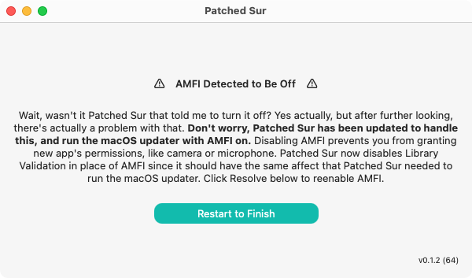

# AMFI Problems

Patched Sur v0.1.0 wanted to turn off AMFI to allow it to inject code into startosinstall to skip the compatibility check. It turns out, this can actually cause some problems. You become unable to grant new permissions \(like Camera and Microphone\) to apps. After a little bit of research, I discovered that you can disable Library Validation which also allows Patched Sur to inject code, without running into the same problems with disabling AMFI. **You only need to care about this if you see a popup in the pre-install app, but it's not something to worry about, Patched Sur can help.**

### Disabling AMFI

After you click on the little red bar on the bottom of the window, you'll be presented with this screen. All you have to do is click Resolve, then it'll prompt for your password and it'll start. This will be a relatively quick task, and in theory, it shouldn't run into any problems. Once it's done you'll see this:

Just click that button \(or manually restart\), and everything will be fixed! No more worries.

### Errors While Disabling AMFI

You might run into an error while disabling AMFI, this is okay though. It is a more manual fix to solve this, but either way, it's fine.

**If Patched Sur says "Failed to Disable Library Validation" and NOT AMFI, then you are perfectly fine. Just restart your Mac and everything is fixed.** 

If it was AMFI that failed to get disabled, once again, don't worry. It's a super easy fix and unless you don't even read these instructions, you won't break anything.

1. Restart your Mac into Recovery Mode. To do this, when your Mac turns back on hold down OPTION-CMD-R, you can let go when you see the spinning globe. When you're given the option, connect to your WiFi network and your Mac should download macOS recovery.
   1. If you see a globe with an exclamation mark, you'll need a macOS installer USB instead, which is the same as Recovery Mode.
2. Once your Mac finishes booting, click on the Utilities menu in the Menu Bar, and click Terminal.
3. In Terminal, type `nvram boot-args="-no_compat_check"` \(type this exactly as is, there is only **one space** which is between nvram and boot-args\). After you type that, press enter. 
4. Restart your Mac, you don't have to hold any special keys this time, and when it boots, you're all good to go. The popup should be gone in Patched Sur. 

