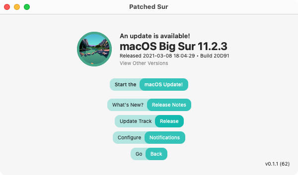

# Updating macOS

If you open the post-install app and try to open the updater, there are two different screens you might run into. The first being the update the patcher app screen and the second being the update macOS screen. Both will provide a simple outlook of information about the new update. If you want to learn some more about updating the app, head over to the Updating The Post Install App section to learn the basics of how it works. 

### Starting the Update

The updating process is super simple. When you open the post-install app and click update macOS and you see this screen: \(unless there's an update available for the app\)

On this screen, you can do several things. You can see the release notes for the latest version of Big Sur, you can configure notifications so you can get notifications for future Big Sur upgrades, and you can change the release track that you're getting Big Sur updates from. 

When you're ready to update macOS, just click "Start the macOS Update" and then enter your password and the update will start. You might get a popup after clicking this, so just follow what they say and it'll work. Once it's done, you just have to Patch the Kexts, and you're done. 

### Patch the Kexts

Finally, once your new version of Big Sur boots, you'll be able to patch the kexts and be finally updated and done. If you have a Late 2013 iMac, you should be fine since everything should work out of the box.

To do this, open the Applications folder or Launchpad and then click Patched Sur. Once it launches, you can select Patch Kexts then Start and enter your password. After it's done, it'll prompt you to restart your Mac and everything will be fine after that!

