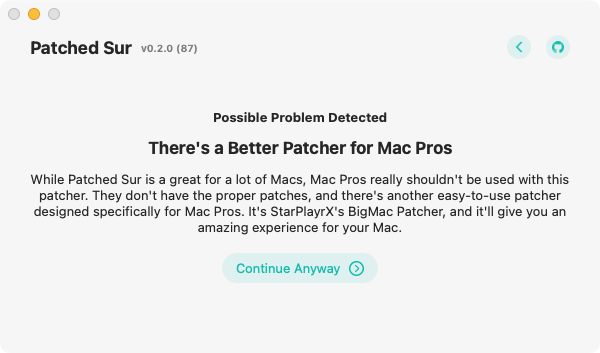
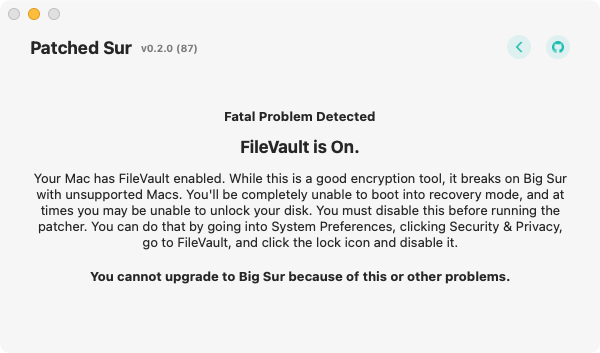
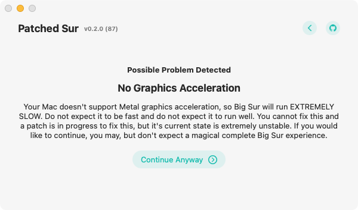

# Learn the Compatiblity

The first thing that the patcher will do is make sure that you can install macOS Big Sur. This step has two parts, the first is to check for bigger problems and the second step is to give you a breakdown of what will and will not work with the patcher. Below, you can see all the different problems you can run into with part one, then after you can see a quick explanation of part two.

## There's a Better Patcher for Mac Pros

Patched Sur supports a lot of Macs, however, some Macs are better off with a different patcher. Mac Pros work sometimes with the patcher, and sometimes they don't. You should really use [StarPlayrX's BigMac Patcher ](https://github.com/StarPlayrX/BigMac)which is designed for Mac Pros, unlike this patcher. 

## FileVault is On

Wait, Patched Sur completely refuses to let me upgrade because of disk encryption? Yep, if you modify system files, then you break disk encryption, preventing you from using macOS recovery of any kind on your system without erasing your Mac when you do so. This is a huge problem, and Patched Sur will not let you upgrade because of it. 

Good News: This is the only problem that you can solve that's detected by this \(even though it's also the only problem that you can't skip\)! Open up System Preferences, go to Privacy and Security, click the lock and enter your password, then disable FileVault. After that, restart your Mac and Patched Sur will let you through. 

## No Graphics Acceleration

This is well explained by the red box, and seriously do not ignore me for saying that pressing continue anyway is dumb and pressing continue anyway without a backup is even dumber. Refer to this chart that explains it as simple as possible:


"No graphics acceleration" is a tremendous, almost exponential, slowdown that **SHOULD NOT** be ignored. For instance, consider a simple task, simply minimizing a Safari window:

* Late 2012 13" MacBook Pro: &lt;1 second
* Early 2011 13" MacBook Pro: 14 seconds
* Late 2009 13" MacBook: 25 seconds

Keep in mind, Mojave and Catalina will probably receive security updates until roughly September 2021 and September 2022 respectively \(give or take a month\), so most users do not need to urgently upgrade to Big Sur.


In other words, it's slow, stay on Mojave or Catalina \(Mojave is better.\)

