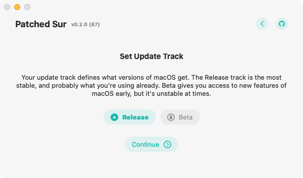

# Update Tracks

Update tracks are what kind of macOS versions you want to get in each update. For example, one track could be the stable/release track and others might be the unstable/beta track. Normally, you are on the release update track, but you can change that in stock macOS by downloading a configuration profile that changes this for you. However, since you are on an unsupported Mac, you can't use System Preferences to update, so you have to choose your track in here and Patched Sur will automatically grab the correct macOS version for you. macOS has three different update tracks available: release, public beta, and developer beta, however because of how insunificant the difference is between public and developer betas, Patched Sur considers them the same exact thing.

## Release Update Track

The release update track is the default and most stable update track. This track contains the macOS updates you would get normally if you were on a supported Mac and did not install a configuration profile to change it. More likely than not, this is the track you want to be on.

## Beta Update Track

The public beta track is the beta that's stable enough for some of the public to use it and provide beta feedback, but not stable enough for distribution yet. It still has bugs and problems, so it is considered a beta track.

