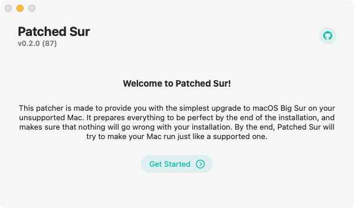

# Starting Out

First of all, you'll need to get the latest version of Patched Sur, which you can download [here](https://github.com/BenSova/Patched-Sur/releases/latest), you only need Patched-Sur.dmg. Once that downloads, open the .app file inside and it should lead you through the process, but here is some more information about each step.



