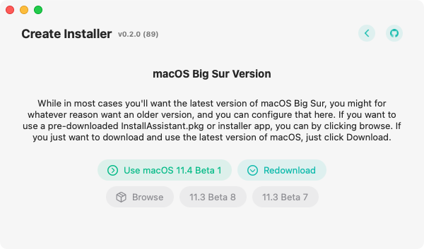
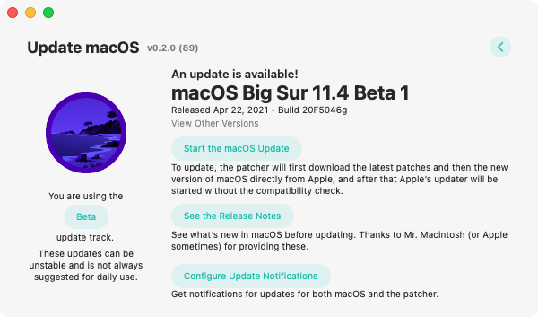
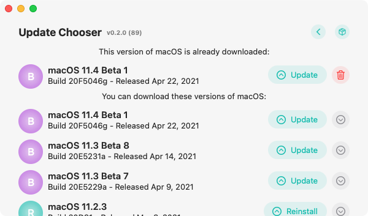

# How To Not Redownload An Installer


Some errors are caused by corrupted installers, so it's not always a good idea to reuse the installer, specifically in those cases. If you are sure that it's not the installer, or Ben told you to come here, then go on ahead and reuse the installer. 

Also in both of these cases, the kexts will still be redownloaded. They're only ~50MB so it's not that bad of a download.


##  When Creating a Patched USB Installer

First, you just need to go through the patcher all the way until you reach this point:

 If you haven't guessed already, you can click "Use macOS 11.X" instead of "Readownload" to skip redownloading the installer. From here on, it's just like normal. You'll be able to select a volume and make the installer.

## When Updating macOS with the post-install app

With the post-install updater, it's a little less obvious, but you still can do it. Since a good amount of the errors while updating macOS are due to a corrupted installer, it doesn't really make sense to put it out in the open. But again, if you are sure it's not the installer, go ahead and continue. Go to the update macOS section and you should see this screen after a second:

Under where it says "Released Month, XX, 2021 - Build XXYZZ", it says "View Other Versions". Click that button. You'll see a screen that looks like this:

If you don't have a section named "This version of macOS is already downloaded", then you can't continue. But if you do, click the Update button \(it's right next to the delete button\) for the macOS version that's under "This version of macOS is already downloaded". After that, it'll go through the updating process like normal, but it won't download the installer.   

